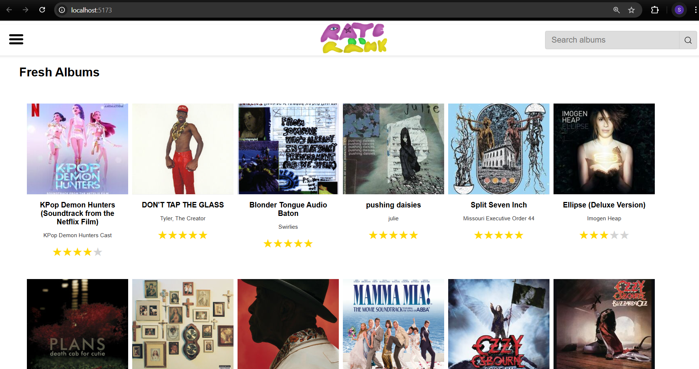
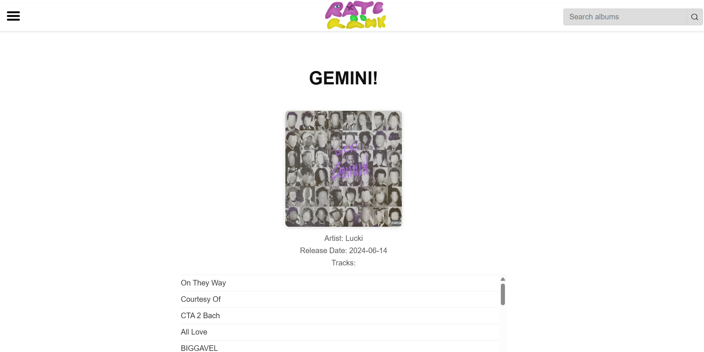
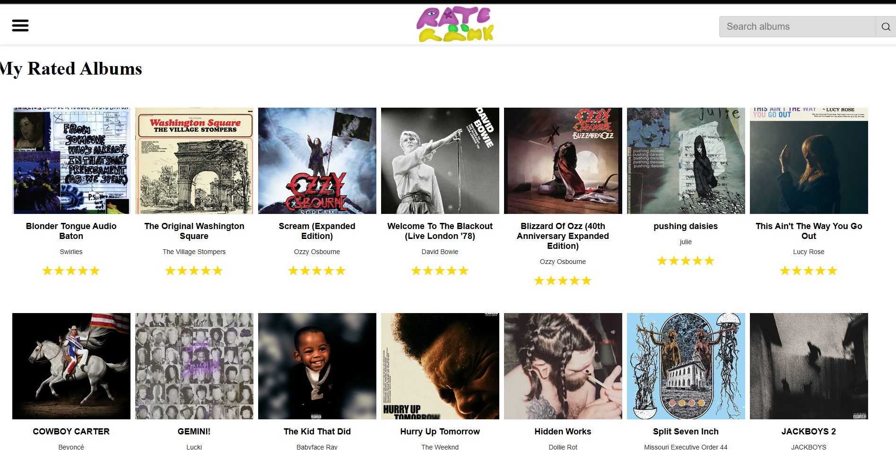
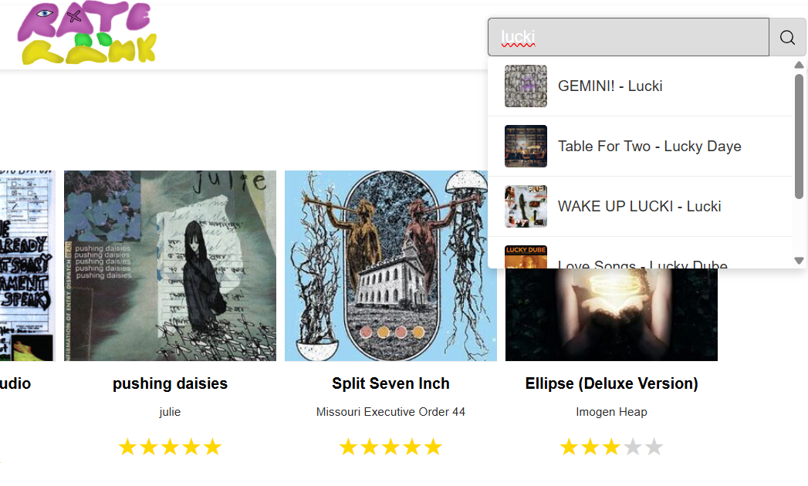

🎵 Rated Albums App 🎶

Welcome to Rated Albums, your ultimate React-powered music companion! 🎧
Discover albums, dive deep into details, rate your favorites ⭐, and keep track of your personal top picks — all in one slick, modern app.

🚀 Features
🔍 Instant Search: Find any album with live autocomplete suggestions.

📀 Album Details: See track lists, release dates, and artist info at a glance.

⭐ Star Ratings: Rate albums with intuitive 5-star controls, saved locally.

📈 Top Rated List: View your highest-rated albums, sorted for easy browsing.

📱 Responsive Design: Clean UI with a smooth collapsible side menu for effortless navigation.

🎬 Screenshots

Home Page

Album Detail Page

Rated Albums Page

Search Function

🛠 Installation
Clone this repo:

bash
Copiază codul
git clone https://github.com/yourusername/rated-albums-app.git
Install dependencies:

bash
Copiază codul
npm install
Run the app locally:

bash
Copiază codul
npm start
🎯 How to Use
Use the search bar to quickly find your favorite albums.

Click an album to open its detail page with tracks and info.

Rate the album by clicking the stars — your rating saves automatically.

Check out your Top Rated albums anytime to relive your favorites.

❤️ Support & Contributions
Love music and code? Feel free to ⭐ star this repo and contribute!
Open issues or submit pull requests — your help is appreciated! 🙌

📄 License
This project is licensed under the MIT License — see the LICENSE file for details.
